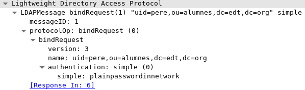

# LDAP GSSAPI

---

### Openldap

Es una implementació del protocol LDAP per gestionar base de dades en forma de directoris.

	dn: uid=roger,o=becaris,ou=professors,dc=edt,dc=org
	objectclass: posixAccount
	objectclass: inetOrgPerson
	cn: roger
	sn: peyas
	homephone: 779-222-0007
	mail: roger@becariprofe.edt.org
	description: becari del departament de informatica
	ou: professors
	o: becaris
	uid: roger
	uidNumber: 11032
	gidNumber: 651
	homeDirectory: /tmp/home/becaris/roger
	userPassword: {SSHA}p4S7d2VFW+36/VGklWGMxPUuMxpkaFxV

---

### Fitxers de configuració Servidor

	include		/etc/openldap/schema/corba.schema
	include		/etc/openldap/schema/core.schema
	include		/etc/openldap/schema/cosine.schema
	include		/etc/openldap/schema/duaconf.schema
	include		/etc/openldap/schema/dyngroup.schema
	include		/etc/openldap/schema/inetorgperson.schema
	include		/etc/openldap/schema/java.schema
	include		/etc/openldap/schema/misc.schema
	include		/etc/openldap/schema/nis.schema
	include		/etc/openldap/schema/openldap.schema
	include		/etc/openldap/schema/ppolicy.schema
	include		/etc/openldap/schema/collective.schema

	# Allow LDAPv2 client connections.  This is NOT the default.
	allow bind_v2

	pidfile		/var/run/openldap/slapd.pid
	#argsfile	/var/run/openldap/slapd.args
	
	database bdb
	suffix "dc=edt,dc=org"
	rootdn "cn=Manager,dc=edt,dc=org"
	rootpw secret
	directory /var/lib/ldap
	index objectClass eq,pres
	access to *
		by self write
	by * read 

---

### Fitxers de configuració Client

	#
	# LDAP Defaults
	#

	# See ldap.conf(5) for details
	# This file should be world readable but not world writable.

	BASE   dc=edt,dc=org
	URI    ldap://ldapserver.edt.org ldaps://ldapserver.edt.org

	TLS_CACERTDIR   /etc/openldap/certs/
	TLS_CACERT      /etc/openldap/certs/cacrt.pem

	# Turning this off breaks GSSAPI used with krb5 when rdns = false
	SASL_NOCANON    on

##### Ordres per configuració server ldap

	slaptest -f slapd.conf -F /etc/openldap/slapd.d/ -u

	slapadd -F /etc/openldap/slapd.d/ -l dataDBuid.ldif

---

## Problema

	ldapwhoami -x -D "uid=pere,ou=alumnes,dc=edt,dc=org" -w plainpasswordinnetwork

	ldapsearch -x -b 'dc=edt,dc=org' 

Autenticació Simple

---

### Diferents metodes de protecció

- StartTLS

- EXTERNAL

- GSSAPI

- SSF

---

### Es posible encriptar les comunicacions del ldap?

StartTLS

· Autenticitat

· Integritat

Creació de certificats

	openssl req -new -x509 -nodes -out cacrt.pem -days 365 -keyout cakey.pem
	 
	openssl req -new -newkey rsa:2048 -keyout ldapserverkey.pem -nodes
	 -out ldapservercsr.pem

	openssl x509 -CA cacrt.pem -CAkey cakey.pem -req -in ldapservercsr.pem
	 -CAcreateserial -out ldapservercert.pem

--- 

## Fitxers de configuració 

Servidor 

	#SSL certificate file paths
	TLSCACertificateFile /etc/openldap/certs/cacrt.pem
	TLSCertificateFile /etc/openldap/certs/ldapservercert.pem
	TLSCertificateKeyFile /etc/openldap/certs/ldapserverkey.pem
	TLSCipherSuite HIGH:MEDIUM:+SSLv2
	TLSVerifyClient never

Client 

	URI     ldap://ldapserver ldaps://ldapserver

	TLS_CACERTDIR   /etc/openldap/certs/
	TLS_CACERT      /etc/openldap/certs/cacrt.pem

---

## Implementació StartTLS

ldapwhoami -Z o ldapwhoami -ZZ ?

---
	
### Es posible que l'informació per autenticar-se no viatgen per la xarxa?

El primer de aquesta clase de metodes es:

· EXTERNAL

Amb aquest metode no cal proporcionar ni DN (usuari) ni userPassword (password)

---

### External Server

	openssl req -new -newkey rsa:2048 -keyout martakey.pem -nodes -out martacsr.pem
	
	openssl x509 -CA /etc/openldap/certs/cacrt.pem  -CAkey /etc/openldap/certs/cakey.pem  -req -in martacsr.pem 
	 -CAcreateserial -out martacert.pem

	Server

	#SSL certificate file paths
	TLSCACertificateFile /etc/openldap/certs/ca.cert
	TLSCertificateFile /etc/openldap/certs/ldapserver.pem
	TLSCertificateKeyFile /etc/openldap/certs/ldap.key
	TLSCipherSuite HIGH:MEDIUM:+SSLv2
	TLSVerifyClient demand

	authz-regexp "^email=([^,]+),cn=([^,]+),ou=alumnes.*,c=ES$" 
	"uid=$2,ou=alumnes,dc=edt,dc=org"
	
	authz-regexp "^email=([^,]+),cn=manager.*,c=ES$" "cn=Manager,dc=edt,dc=org"
	authz-regexp "^email=([^,]+),cn=([^,]+),ou=professors,o=tarda.*,c=ES$" 
	"uid=$2,o=tarda,ou=professors,dc=edt,dc=org"
	
	authz-regexp "^email=([^,]+),cn=([^,]+),ou=professors,o=mati.*,c=ES$" 
	"uid=$2,o=mati,ou=professors,dc=edt,dc=org"
	
	authz-regexp "^email=([^,]+),cn=([^,]+),ou=professors,o=caps.*,c=ES$" 
	"uid=$2,o=caps,ou=professors,dc=edt,dc=org"
	
	authz-regexp "^email=([^,]+),cn=([^,]+),ou=professors,o=becaris.*,c=ES$" 
	"uid=$2,o=becaris,ou=professors,dc=edt,dc=org"

---

### External Client

Un client, un certificat i un connexió.
	
	SASL_MECH EXTERNAL
	TLS_CERT /path/certificate.pem
	TLS_KEY /path/certificatekey.pem
	TLS_CACERT /etc/openldap/certs/cacrt.pem
	
	ldapwhoami -ZZ 

Casos

	User marta
	User pere 
	User anna 
	
---

### GSSAPI

El segon metode inclou Keberos i Cyrus Sasl

Cyrus SASL

	cyrus-sasl-gssapi 
	cyrus-sasl-ldap

---

### Fitxers de configuracions Kerberos

krb5.conf
	
	[logging]
	 default = FILE:/var/log/krb5libs.log
	 kdc = FILE:/var/log/krb5kdc.log
	 admin_server = FILE:/var/log/kadmind.log

	[libdefaults]
	 dns_lookup_realm = false
	 ticket_lifetime = 24h
	 renew_lifetime = 7d
	 forwardable = true
	 rdns = false
	 default_realm = EDT.ORG
	# default_ccache_name = KEYRING:persistent:%{uid}

	[realms]
	 EDT.ORG = {
	  kdc = skerberos.edt.org
	  admin_server = skerberos.edt.org
	 }

	[domain_realm]
	 .edt.org = EDT.ORG
	 edt.org = EDT.ORG

---

### Fitxers de configuracions Kerberos 

/var/kerberos/krb5kdc/kdc.conf

	[kdcdefaults]
	 kdc_ports = 88
	 kdc_tcp_ports = 88

	[realms]
	 EDT.ORG = {
	  #master_key_type = aes256-cts
	  acl_file = /var/kerberos/krb5kdc/kadm5.acl
	  dict_file = /usr/share/dict/words
	  admin_keytab = /var/kerberos/krb5kdc/kadm5.keytab
	  supported_enctypes = aes256-cts:normal aes128-cts:normal des3-hmac-sha1:normal arcfour-hmac:normal camellia256-cts:normal 
	  camellia128-cts:normal des-hmac-sha1:normal des-cbc-md5:normal des-cbc-crc:normal
	 }

/var/kerberos/krb5kdc/kadm5.acl

	*/admin@EDT.ORG	*

Crear la base de dades de kerberos

	/usr/sbin/kdb5_util create -P masterkey -s
	
---

### Afegir els principals

	admin/admin
	pau/alumnes
	pere/alumnes
	anna/alumnes
	marta/alumnes
	jordi/alumnes
	admin/alumnes
	user01/alumnes
	user02/alumnes
	user03/alumnes
	user04/alumnes
	user05/alumnes
	user06/alumnes
	user07/alumnes
	user08/alumnes
	user09/alumnes
	user10/alumnes
	marta/professors.tarda
	jordi/professors.tarda
	anna/professors.mati
	marc/professors.mati
	robert/professors.tarda
	bernat/professors.mati
	carme/professors.caps
	roger/professors.becaris

---

### Afegir els principals (II)

	#! /bin/bash
	#Nick Inga Reynaldo
	#Projecte LDAP GSSAPI
	#Script que apartir d'un fitxer amb usuaris creara els principals
	#en la base de dades de kerberos per que despres la exporten al 
	#servidor ldap. 

	while read -r line 
	do 
		#definició de variables del usuari i password
		user=$(echo $line)
		password=$(echo $line | cut -f1 -d '/')
		#Query per afegir un principal
		/usr/sbin/kadmin.local -q "addprinc -pw k$password $user"

	done < usuaris 

Afegir el servei ldap al principals
	
	/usr/sbin/kadmin.local -q "addprinc -pw randkey ldap/ldapserver.edt.org"

	/usr/sbin/krb5kdc -P /var/run/krb5kdc.pid $KRB5KDC_ARGS
	/usr/sbin/kadmind -nofork -P /var/run/kadmind.pid $KADMIND_ARGS
---

### Fitxers de configuracions Ldapserver

Global

	sasl-secprops noanonymous,noplain,noactive
	sasl-realm EDT.ORG
	sasl-host ldapserver.edt.org

	authz-regexp "^uid=[^,/]+/admin,cn=edt\.org,cn=gssapi,cn=auth" 
	"cn=Manager,dc=edt,dc=org"
	
	authz-regexp "^uid=[^,/]+/professors.tarda,cn=edt\.org,cn=gssapi,cn=auth" 
	"uid=$1,o=tarda,ou=professors,dc=edt,dc=org"
	
	authz-regexp "^uid=[^,/]+/professors.mati,cn=edt\.org,cn=gssapi,cn=auth" 
	"uid=$1,o=mati,ou=professors,dc=edt,dc=org"
	
	authz-regexp "^uid=[^,/]+/professors.caps,cn=edt\.org,cn=gssapi,cn=auth" 
	"uid=$1,o=caps,ou=professors,dc=edt,dc=org"
	
	authz-regexp "^uid=[^,/]+/professors.becaris,cn=edt\.org,cn=gssapi,cn=auth"
	"uid=$1,o=becaris,ou=professors,dc=edt,dc=org"
	
	authz-regexp "^uid=[^,/]+/alumnes,cn=edt\.org,cn=gssapi,cn=auth"
	 "uid=$1,ou=alumnes,dc=edt,dc=org"

---

### Fitxers de configuracions Ldapserver

Database

	database bdb
	suffix "dc=edt,dc=org"
	rootdn "cn=Manager,dc=edt,dc=org"
	rootpw {SASL}admin/admin@EDT.ORG
	directory /var/lib/ldap
	index objectClass eq,pres
	access to *
			by self write
			by * read

Configuració de kerberos en ldapserver host

	/usr/bin/kadmin -p admin/admin -w kadmin -q 
	"ktadd -k /etc/krb5.keytab ldap/ldapserver.edt.org"
	
	/usr/bin/chown ldap.ldap /etc/krb5.keytab

Com ha client de Kerberos també he definit el fitxer krb5.conf 

---

## Client GSSAPI

Autenticació mitajançant tiquets

	kinit anna/professors.mati

	klist
	Ticket cache: FILE:/tmp/krb5cc_0
	Default principal: anna/professors.mati@EDT.ORG

	Valid starting     Expires            Service principal
	05/17/18 23:01:51  05/18/18 23:01:51  krbtgt/EDT.ORG@EDT.ORG

---

## SSF

Determina el grau de protecció de la base de dades.

	0 cap	1 integritat 	1 > cifratge o mecanisme

	ssf : Defineix les ssf en general 									
	transport : Defineix les ssf en el transport                         
	tls	: Defineix les ssf en el TLS									
	sasl : Defineix les ssf en el SASL							
	update_ssf : Defineix les ssf en general per permetre la modificació del directori	
	update_transport : Defineix les ssf en el transport per permetre la modificació del directori
	update_tls  : Defineix les ssf en el TLS per permetre la modificació del directori		
	update_sasl  : Defineix les ssf en el SASL per permetre la modificació del directori	
	simple_bind  : Directiva encarregada de fer un traduccion entre els usuaris sasl a usuaris simples de la base de dades

Modificació en slapd.conf

	security update_ssf=256

---

## Client 

GSSAPI té un grau de protecció de 256

Tiquet

	kinit pere/alumnes
	Password for pere/alumnes@EDT.ORG: 

Modificació

	ldapmodify -Y GSSAPI -f modify.ldif 
	SASL/GSSAPI authentication started
	SASL username: pere/alumnes@EDT.ORG
	SASL SSF: 256
	SASL data security layer installed.
	modifying entry "uid=pere,ou=alumnes,dc=edt,dc=org"

---

## Conclusions i preguntes

---

